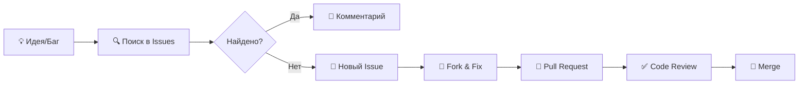

# 🗂️ DROP.CLOUD

> **ESP8266 SD Card File Server v2.0**  
> *Превратите ваш ESP8266 в автономный файловый сервер с веб-интерфейсом*

[](https://github.com/VS-DropCloud/ESP8266-FileServer/releases)
[](LICENSE)
[](https://www.espressif.com/en/products/socs/esp8266)
[](https://www.arduino.cc/)
[](#)
[](#)

---

## 📋 Оглавление

<details>
<summary><strong>Нажмите для раскрытия</strong></summary>

- [✨ Особенности](#-особенности)
- [🖼️ Демонстрация](#-демонстрация)
- [📦 Комплектующие](#-комплектующие)
- [🔧 Сборка](#-сборка)
- [⚡ Быстрый старт](#-быстрый-старт)
- [🏗️ Архитектура](#-архитектура)
- [🔐 Безопасность](#-безопасность)
- [📡 API](#-api)
- [🐛 Отладка](#-отладка)
- [🤝 Вклад в проект](#-вклад-в-проект)
- [📄 Лицензия](#-лицензия)
- [🙏 Благодарности](#-благодарности)

</details>

---

## ✨ Особенности

```diff
+ 🌐 Полностью автономный WiFi Access Point (192.168.4.1)
+ 🗂️ Полный файловый менеджер: просмотр, загрузка, выгрузка, удаление
+ 🎨 Современный тёмный UI в стиле VS_Drop.cloud с анимациями
+ ⚡ Потоковая передача файлов любого размера (без загрузки в RAM)
+ 🔐 HTTP Basic Auth + сессионные куки
+ 📊 Отображение свободного места и статистики в реальном времени
+ 🧠 Оптимизация памяти: PROGMEM, F(), streaming (экономия ~15 КБ RAM)
+ 🔌 Поддержка SD карт до 32 ГБ (FAT32)
+ 📱 Адаптивный дизайн для мобильных устройств
+ 🛡️ Защита от Path Traversal и несанкционированного доступа
+ 🔄 Chunked Transfer Encoding для стабильной передачи
```

### 📊 Технические характеристики

| Параметр | Значение |
|----------|----------|
| **Процессор** | Tensilica L106 32-bit @ 80 MHz |
| **Доступная RAM** | ~40-50 КБ (после инициализации WiFi) |
| **Flash** | 4 МБ (внешний, зависит от модуля) |
| **WiFi** | 802.11 b/g/n, 2.4 GHz, SoftAP режим |
| **SD интерфейс** | SPI @ 6 MHz (HALF_SPEED для стабильности) |
| **Макс. файл** | Не ограничен (потоковая обработка) |
| **Скорость передачи** | 200-400 КБ/с (зависит от карты) |
| **Одновременные клиенты** | 4-8 (ограничение SDK) |

---

## 🖼️ Демонстрация

### 🎬 Интерфейс

```
┌────────────────────────────────
│  🔐 ВХОД В СИСТЕМУ                   
│  ┌─────────────────────────┐           
│  │  Логин:  [admin    ]    │           
│  │  Пароль: [•••••••]      │          
│  │  [🔓 ВОЙТИ]             │           
│  └─────────────────────────┘           
│  VS_Drop.cloud v2.0 • ESP8266         
└───────────────────────────────
```

```
┌────────────────────────────
│  📁 ФАЙЛОВЫЙ МЕНЕДЖЕР                   
│  ┌─────────────────────────┐            
│  │  📂 Documents/                     
│  │  📂 Photos/                    
│  │  📄 report.pdf   2.4 MB               
│  │  🖼️ image.jpg    1.8 MB               
│  │  🎵 audio.mp3    5.2 MB               
│  │--------------------------           
│  │  💾 Свободно: 12.4 ГБ                
│  │  [⬆️ Загрузить] [➕ Папка]       
│  └─────────────────────────┘           
└────────────────────────────
```

> 📸 *Полноэкранные скриншоты доступны в папке [`/docs/screenshots`](docs/screenshots/)*

---

## 📦 Комплектующие

### 🔧 Аппаратная часть

```yaml
Минимальный набор:
  ├─ 📦 ESP8266 модуль (NodeMCU / Wemos D1 mini / ESP-01 с адаптером)
  ├─ 💾 SD Card модуль (3.3V logic!)
  ├─ 🗄️ MicroSD карта (FAT32, до 32 ГБ)
  ├─ 🔌 USB кабель для программирования
  └─ 🔗 Провода для соединения (или макетная плата)

Рекомендуемые компоненты:
  ├─ ⚡ Стабилизатор 3.3V (если питание от 5V)
  ├─ 🔋 Конденсатор 10-100 мкФ (стабилизация питания)
  ├─ 📦 Корпус (3D-печатный или готовый)
  └─ 🎨 LED индикаторы активности (опционально)
```

### 🔌 Схема подключения

```
┌─────────────┐          ┌─────────────┐
│   ESP8266   │   SPI    │  SD Module  │
├─────────────┤          ├─────────────┤
│  GPIO13 (D7)│──MOSI───▶│  MOSI / DI │
│  GPIO12 (D6)│◀─MISO───│  MISO / DO  │
│  GPIO14 (D5)│──SCK────▶│  SCK / CLK │
│  GPIO4  (D2)│──CS─────▶│  CS / SS   │
│  3.3V       │─────────▶│  VCC       │
│  GND        │──────────│  GND        │
└─────────────┘          └─────────────┘

⚠️  ВАЖНО: Не подключайте 5V к SD карте! Только 3.3V!
```

---

## 🔧 Сборка

### 🧪 Этап 1: Прототип на макетной плате

1. Соберите схему согласно [подключению выше](#-схема-подключения)
2. Проверьте целостность соединений мультиметром
3. Подайте питание и убедитесь в отсутствии КЗ

### 🔥 Этап 2: Пайка (опционально)

```bash
📋 Контрольный список:
☐ Все соединения пропаяны и изолированы
☐ SD модуль зафиксирован (термоусадка/клей)
☐ Проверена полярность питания
☐ Протестирована работа на макетке перед пайкой
```

### 📦 Этап 3: Финальная сборка

```
┌─────────────────────────────────┐
│          [📦 Корпус]            │
│  ┌─────────────────────────┐    │
│  │  ┌─────────────────┐    │    │
│  │  │   Плата с       │    │    │
│  │  │   ESP8266+SD    │    │    │
│  │  └─────────────────┘    │    │
│  │                         │    │
│  │  [🔌 USB]  [🗄️ SD слот  │    │
│  └─────────────────────────┘    │
│        [📡 WiFi антенна]        │
└─────────────────────────────────┘
```

> 📷 *Фото процесса сборки: [`/docs/assembly`](docs/assembly/)*

---

## ⚡ Быстрый старт

### 1️⃣ Подготовка среды

```bash
# Установите Arduino IDE: https://www.arduino.cc/en/software

# Добавьте поддержку ESP8266:
# Файл → Настройки → Дополнительные ссылки:
#   https://arduino.esp8266.com/stable/package_esp8266com_index.json

# Установите платы:
# Инструменты → Плата → Менеджер плат → "esp8266" → Установить

# Установите библиотеки (Менеджер библиотек):
☑ ESP8266WiFi (входит в пакет)
☑ ESP8266WebServer (входит в пакет)
☑ SD (входит в пакет)
```

### 2️⃣ Настройка прошивки

Откройте `VS_Drop_Cloud_ESP8266.ino` и отредактируйте конфигурацию:

```cpp
// ⚙️ Файл: config.h (или верхняя часть .ino)

// WiFi Access Point
#define AP_SSID       "VS_Drop_Cloud"    // Имя сети
#define AP_PASSWORD   "admin123"         // Мин. 8 символов

// Аутентификация веб-интерфейса
#define AUTH_USER     "admin"
#define AUTH_PASS     "admin"

// Аппаратные настройки
#define SD_CS_PIN     4       // GPIO4 = D2 на NodeMCU
#define CHUNK_SIZE    8192    // 8 КБ буфер (оптимум для ESP8266)

// Ограничения
#define MAX_UPLOAD_SIZE (4UL * 1024 * 1024)  // 4 МБ на файл
```

### 3️⃣ Прошивка и запуск

```bash
# 1. Подключите ESP8266 по USB
# 2. Выберите в Arduino IDE:
#    - Плата: "NodeMCU 1.0 (ESP-12E Module)"
#    - Порт: ваш COM-порт
#    - Flash Size: "4MB (FS:2MB OTA:~1019KB)"
#    - Upload Speed: 921600

# 3. Загрузите прошивку (Ctrl+U)
# 4. Откройте монитор порта (115200 бод)

[INF] System started
[INF] SD card initialized: 15.8 GB total
[INF] WiFi AP started: VS_Drop_Cloud @ 192.168.4.1
[INF] HTTP server listening on port 80
```

### 4️⃣ Подключение

```
📱 На смартфоне/ноутбуке:

1. Подключитесь к сети: "VS_Drop_Cloud"
   Пароль: admin123

2. Откройте браузер и перейдите по адресу:
   👉 http://192.168.4.1

3. Введите логин/пароль:
   👤 admin / 🔐 admin

4. Готово! 🎉
```

---

## 🏗️ Архитектура

### 🔄 Общая схема работы

```mermaid
graph LR
    A[📱 Клиент] -->|WiFi HTTP| B[📦 ESP8266]
    B -->|SPI| C[💾 SD Карта]
    B -->|Flash| D[💻 Веб-интерфейс]
    
    subgraph "Запрос файла"
        A -->|GET /download| B
        B -->|streamFile()| C
        C -->|chunks 8KB| B
        B -->|chunked encoding| A
    end
    
    subgraph "Загрузка файла"
        A -->|POST multipart| B
        B -->|write() chunks| C
        B -->|progress| A
    end
```

### 🧠 Оптимизация памяти

```
┌─────────────────────────────────────────┐
│           Распределение RAM             │
├─────────────────────────────────────────┤
│  WiFi Stack (SDK)     │ ████████ 24 KB │
│  lwIP TCP/IP          │ ████      8 KB │
│  System buffers       │ ██        4 KB │
│  HTTP Server          │ ██        4 KB │
├───────────────────────┼────────────────┤
│  ✅ Доступно для кода │ ~40-50 KB     │
└─────────────────────────────────────────┘

🔑 Ключевые техники:
• PROGMEM — хранение HTML/CSS в Flash
• F() — строки в Flash для Serial/конкатенации
• Streaming — чтение/запись по 8 КБ чанкам
• yield() — предотвращение watchdog reset
```

---

## 🔐 Безопасность

### 🛡️ Реализованные меры

```cpp
// ✅ Защита от Path Traversal
String sanitizePath(String path) {
  if (path.indexOf("..") >= 0 || path.startsWith("/etc")) {
    return "/";  // Сброс к безопасному пути
  }
  return path;
}

// ✅ Проверка аутентификации
bool checkAuth() {
  return server.hasHeader("Cookie") && 
         server.header("Cookie").indexOf(sessionToken) != -1;
}

// ✅ Ограничение размера загрузки
if (upload.totalSize > MAX_UPLOAD_SIZE) {
  uploadFile.close();
  server.send(413, "text/plain", "File too large");
  return;
}

// ✅ Запрет удаления корня
if (path == "/") {
  server.send(400, "text/plain", "Cannot delete root");
  return;
}
```

### ⚠️ Известные ограничения

| Уязвимость | Статус | Рекомендация |
|------------|--------|--------------|
| 📡 Нет HTTPS | 🔴 Не поддерживается железом | Использовать в изолированной сети |
| 🔑 Пароли в plain text | 🔴 HTTP Basic Auth | Не использовать в публичных сетях |
| 🔄 Сессия в RAM | 🟡 Сброс при перезагрузке | Принимать как особенность устройства |
| 👥 Один пользователь | 🟡 Единый токен | Для личного использования достаточно |

> 🔒 **Рекомендация**: Используйте DROP.CLOUD только в доверенной локальной сети.

---

## 📡 API

### 🌐 HTTP Endpoints

```http
# 🔐 Аутентификация
POST /login
Content-Type: application/x-www-form-urlencoded
user=admin&pass=admin
→ 302 Found + Set-Cookie: session=abc123

# 📁 Список файлов
GET /?path=/Documents
Cookie: session=abc123
→ 200 OK + HTML с файлами

# ⬇️ Скачивание
GET /download?path=/file.pdf
→ 200 OK + stream file (chunked)

# ⬆️ Загрузка
POST /upload
Content-Type: multipart/form-data
→ 200 OK при успехе

# 🗑️ Удаление
POST /delete?path=/old.txt
→ 200 OK / 400 Bad Request

# 📊 Информация
GET /info
→ 200 OK + JSON: {free: 12345678, total: 32000000}
```

### 📦 Пример запроса (cURL)

```bash
# Авторизация и получение списка файлов
curl -c cookies.txt -d "user=admin&pass=admin" http://192.168.4.1/login
curl -b cookies.txt http://192.168.4.1/?path=/

# Скачивание файла
curl -b cookies.txt -O http://192.168.4.1/download?path=/report.pdf

# Загрузка файла
curl -b cookies.txt -F "file=@local.jpg" http://192.168.4.1/upload
```

---

## 🐛 Отладка

### 🔍 Мониторинг памяти

```cpp
// Включите отладку в config.h:
#define DEBUG_LEVEL 2  // 0=off, 1=error, 2=info, 3=debug

// В Serial Monitor (115200 бод) вы увидите:
[INF] System started
[INF] SD card initialized: 15.8 GB total
[MEM] Free: 41248 bytes
[UPLOAD] report.pdf: 2457600 bytes ✓
```

### 🚨 Частые проблемы

```diff
! "Exception (0)" или перезагрузка
  → Проверьте использование RAM: избегайте String-конкатенации
  → Используйте F() и PROGMEM для строк

! "SD init failed"
  → Проверьте подключение CS (GPIO4)
  → Попробуйте SPI_HALF_SPEED или ниже
  → Убедитесь, что карта отформатирована в FAT32

! Файл не загружается полностью
  → Проверьте MAX_UPLOAD_SIZE в конфиге
  → Убедитесь, что на карте есть место
  → Добавьте yield() в циклы записи

! Клиент отключается при скачивании
  → Проверьте yield() в цикле streaming
  → Уменьшите CHUNK_SIZE до 4096
  → Проверьте стабильность питания
```

### 🧪 Diagnostic-режим

```cpp
// Отправьте запрос для диагностики:
GET /debug

// Ответ:
{
  "heap_free": 41248,
  "heap_max": 49152,
  "sd_initialized": true,
  "wifi_clients": 1,
  "uptime_seconds": 3600,
  "version": "2.0"
}
```

---

## 🤝 Вклад в проект



### 📋 Guidelines

```markdown
## Перед созданием PR:

☐ Протестировано на реальном ESP8266
☐ Проверено потребление RAM (ESP.getFreeHeap())
☐ Добавлены комментарии для сложных участков
☐ Обновлена документация при изменении API
☐ Соблюдён стиль кода (2 пробела, именование)

## Формат коммитов:

feat: добавление новой функции
fix: исправление бага
docs: обновление документации
refactor: рефакторинг без изменения логики
chore: сборка/инструменты
```

---

## 📄 Лицензия

```
MIT License

Copyright (c) 2024 VS_Drop.cloud Team

Permission is hereby granted, free of charge, to any person obtaining a copy
of this software and associated documentation files (the "Software"), to deal
in the Software without restriction, including without limitation the rights
to use, copy, modify, merge, publish, distribute, sublicense, and/or sell
copies of the Software, and to permit persons to whom the Software is
furnished to do so, subject to the following conditions:

The above copyright notice and this permission notice shall be included in all
copies or substantial portions of the Software.

THE SOFTWARE IS PROVIDED "AS IS", WITHOUT WARRANTY OF ANY KIND...
```

> 📜 Полный текст: [`LICENSE`](LICENSE)

---

## 🙏 Благодарности

```diff
+ @esp8266/Arduino — отличная поддержка платформы
+ @greiman/SdFat — надёжная библиотека для SD карт
+ @PlatformIO — удобная альтернатива Arduino IDE
+ Всем контрибьюторам и тестировщикам 🙌
```

### 📚 Полезные ресурсы

- [ESP8266 Non-OS SDK Documentation](https://www.espressif.com/en/support/documents/technical-documents)
- [SPIFFS/LittleFS для ESP8266](https://github.com/esp8266/Arduino/tree/master/libraries/LittleFS)
- [HTTP Chunked Transfer Encoding (RFC 7230)](https://tools.ietf.org/html/rfc7230#section-4.1)
- [FAT32 Specification](https://download.microsoft.com/download/1/6/1/161ba512-40e2-4cc9-843a-923143f34569/fatgen103.pdf)

---

```
╔══════════════════════════════════════════════════════════════╗
║                                                              ║
║   🗂️  DROP.CLOUD v2.0  •  ESP8266 File Server               ║
║                                                              ║
║   "Маленький чип — большие возможности"                      ║
║                                                              ║
║   🐛 Нашли баг? → [Создать Issue](../../issues/new)          ║
║   💡 Есть идея? → [Обсудить](../../discussions)              ║
║   ⭐ Нравится? → Поставьте звезду ⭐                         ║
║                                                              ║
╚══════════════════════════════════════════════════════════════╝
```

> 🔄 **Последнее обновление**: Апрель 2026  
> 📬 **Контакты**: [GitHub Issues](../../issues) • [Discussions](../../discussions)
